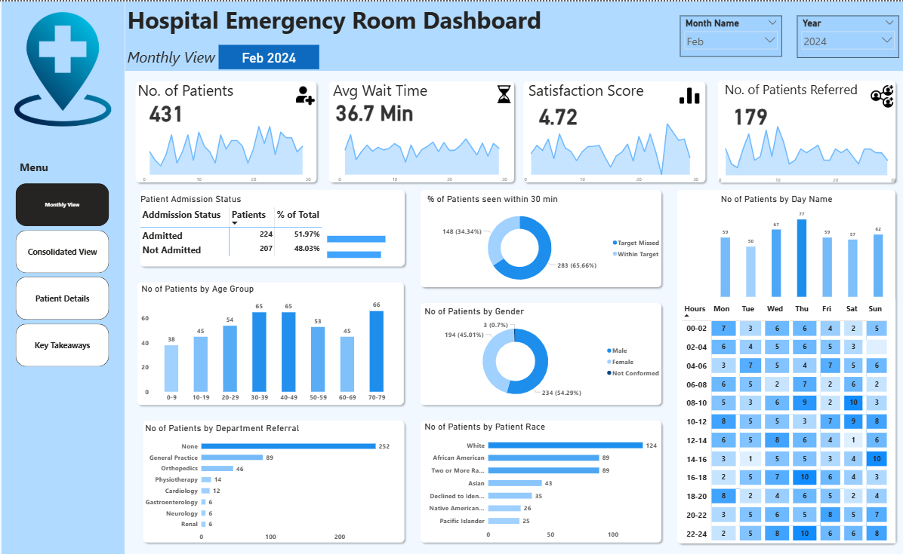
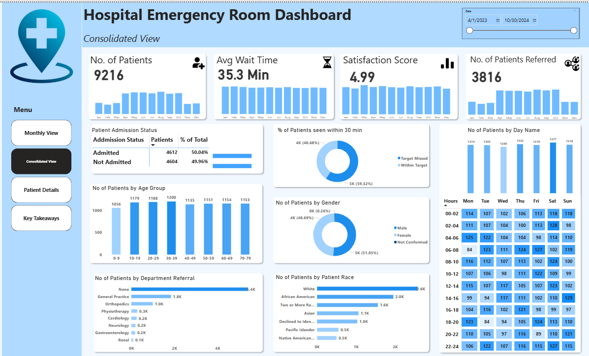
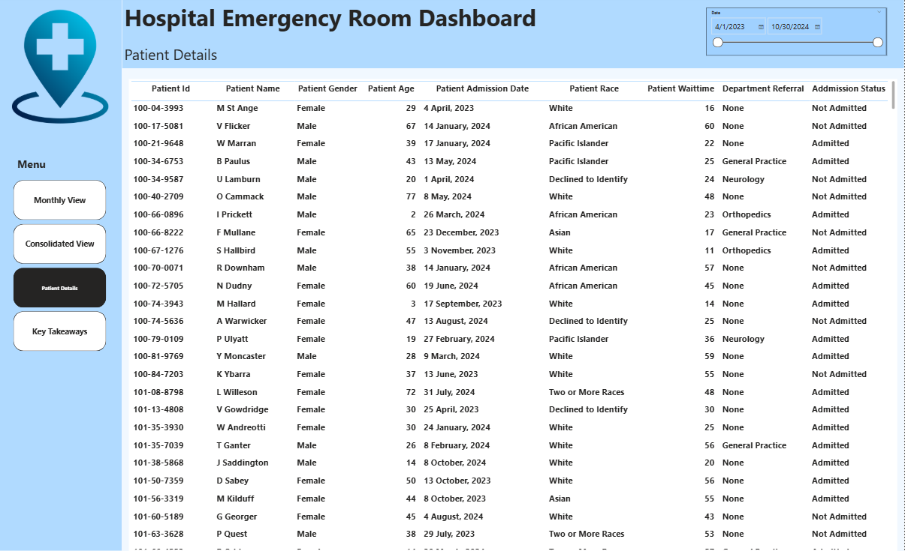
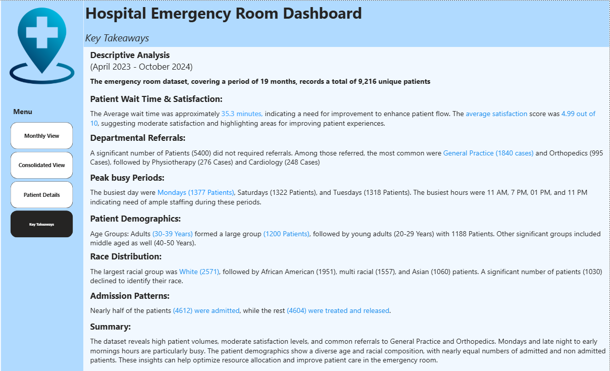

# Hospital-Emergency-Room-Dashboard
📊 Power BI dashboard for analyzing hospital emergency room data (2023–2024). Interactive insights on wait times, referrals, demographics, satisfaction, and admission trends.

# 🏥 Hospital Emergency Room Dashboard - Power BI Project

## 📌 Project Overview

This project presents an interactive Power BI dashboard designed to analyze emergency room (ER) data collected over a period of **19 months** (April 2023 - October 2024), covering **9,216 unique patients**.

The dashboard provides actionable insights on patient wait times, satisfaction levels, admission patterns, departmental referrals, and patient demographics. It aims to support hospital decision-makers in improving patient experience and optimizing resource allocation.

---

## 📊 Dashboard Structure

The Power BI dashboard is divided into **four main pages**:

### 1. 🔵 Monthly View
- Dynamic view based on selected month and year.
- Key Metrics:
  - Number of Patients
  - Average Wait Time
  - Satisfaction Score
  - Referral Count
- Visualizations by:
  - Age Group
  - Gender
  - Race
  - Day of Week & Time Slot
  - Seen Within 30 Minutes
  - Admission Status

### 2. 🟠 Consolidated View
- Aggregated insights across the entire dataset or selected date range.
- Insights include:
  - Peak Busy Days & Hours
  - Most Referred Departments
  - Admission Ratios
  - Wait Time Trends

### 3. 🟢 Patient Details
- A detailed interactive table showing individual patient records with:
  - ID, Name, Age, Gender, Race
  - Admission Date, Wait Time, Referral Department
  - Admission Status

### 4. 🟣 Key Takeaways
- Summary of descriptive analysis:
  - Average wait time: **35.3 minutes**
  - Satisfaction score: **4.99 / 10**
  - 50% of patients were admitted
  - Most referrals: **General Practice**, **Orthopedics**
  - Peak days: **Mondays**, **Saturdays**, **Tuesdays**

---

## 📈 Key Insights

- 🔹 **High volume of non-referred cases**: Over 5,400 patients did not require referrals.
- 🔹 **Busy Hours**: 11 AM, 7 PM, 1 PM, and 11 PM were the busiest.
- 🔹 **Age Group**: Majority of patients were aged **30–39 years**.
- 🔹 **Race Distribution**: Most patients identified as **White (2,571)**, followed by **African American (1,951)**.
- 🔹 **Admission Rate**: ~50% admitted; rest treated and released.
- 🔹 **Improvement Area**: Moderate satisfaction score suggests a need to enhance patient flow and care experience.

---

## 🛠️ Tools & Technologies

- **Power BI**
- **DAX (Data Analysis Expressions)**
- **Data Cleaning & Modeling**

---

## 📁 Project Files

- `Hospital_ER_Dashboard.pbix`: Power BI file containing all dashboards and data model.
- `images/`: Screenshots of each dashboard page.
- `README.md`: Project documentation.

---

## 📷 Sample Dashboard Screens

| Monthly View | Consolidated View | Patient Details | Key Takeaways |
|--------------|-------------------|-----------------|----------------|
|  |  |  |  |

---

## 📬 Contact

If you have any questions or suggestions, feel free to reach out:

**Mahmoud Reda**  
Email: mahmoud.reda.eltabakh@gmail.com  
LinkedIn: [Mahmoud Eltabakh](https://www.linkedin.com/in/mahmoud-reda2001/)  

---

## ⭐ Acknowledgements

This project is part of my data analytics portfolio and showcases the power of **Power BI** in healthcare data analysis.  

---

